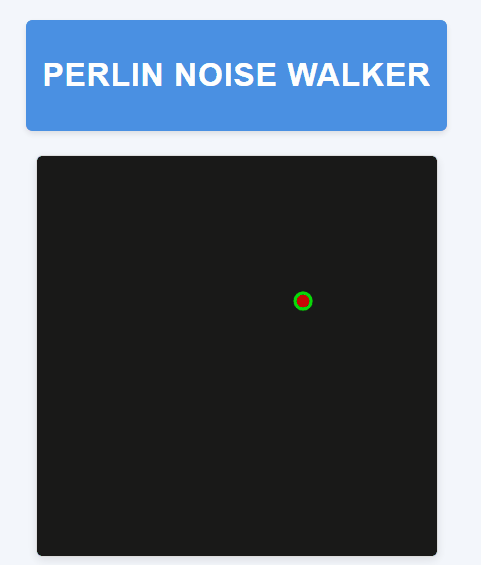

# Perlin Noise Walker 🔴

Uma visualização interativa simples demonstrando movimento com ruído Perlin usando p5.js. O projeto cria um padrão de movimento suave e orgânico para um círculo vermelho com contorno verde.

<div align="center">
  
</div>

## Visão Geral

Este projeto implementa um "walker" - um círculo que se move pela tela usando ruído Perlin para gerar movimentos aleatórios suaves e naturais. O movimento parece mais orgânico do que usar valores puramente aleatórios, criando um efeito visual interessante.

## Características

- Movimento suave de partícula usando ruído Perlin
- Canvas de 500x500 com fundo escuro
- Círculo vermelho com contorno verde como walker
- Animação contínua

## Tecnologias Utilizadas

- HTML5
- JavaScript
- Biblioteca [p5.js](https://p5js.org/) (v1.9.0)

## Como Executar

1. Clone este repositório:

```bash
git clone https://github.com/sj-silva/perlin-noise-walker.git
```

2. Abra o arquivo `index.html` no seu navegador

   ou

   Use um servidor local (como Live Server no VS Code) para executar o projeto

## Como Funciona

A posição do walker é determinada por dois valores de ruído Perlin (tx e ty) que são incrementados ao longo do tempo. Esses valores são mapeados para as dimensões do canvas para criar um movimento suave e contínuo.

## Licença

Este projeto é de código aberto e está disponível sob a [Licença MIT](https://opensource.org/licenses/MIT).
